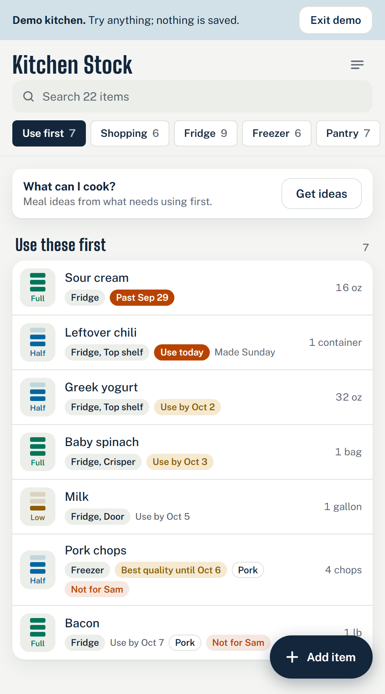
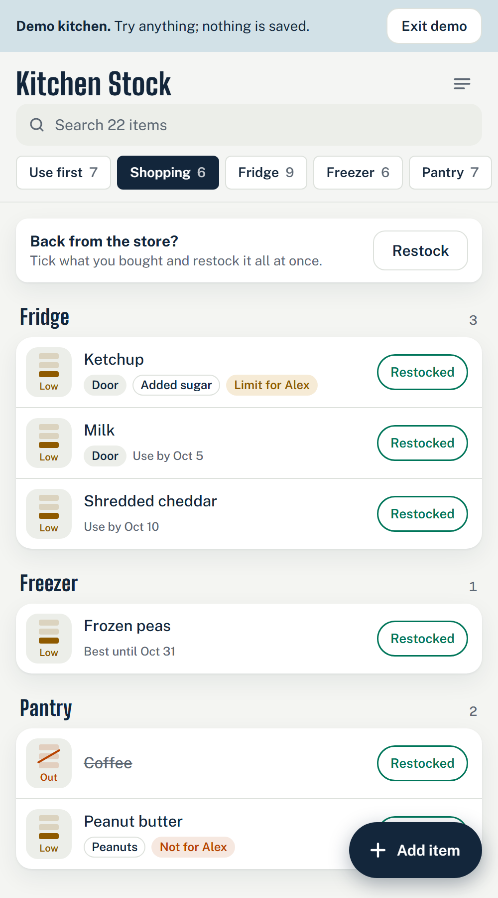
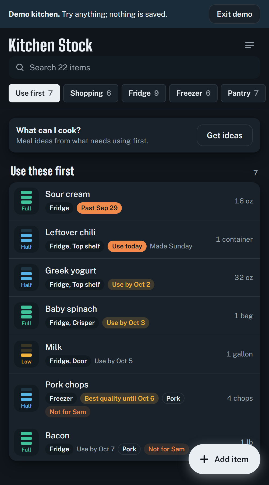
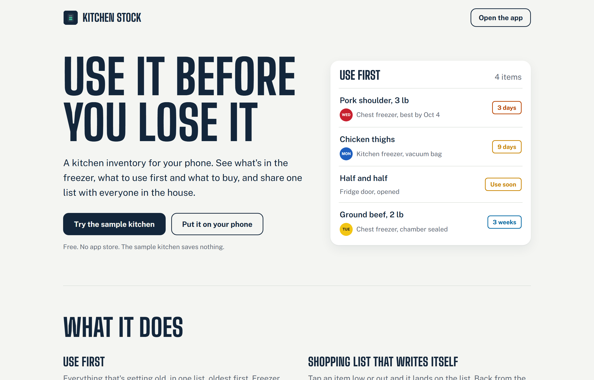

# Kitchen Stock

A household kitchen inventory app, built as an installable web app (PWA) for Android and iPhone. A professional sets up a household's kitchen, and the household keeps using the app to know what's in the freezer, what to use first, and what to buy.

<p>
  
  
  
</p>



Screens are from the built-in sample kitchen. The landing page lives at `/about.html`, and `/?demo` opens the sample kitchen straight from a link.

## What it does

- **Lists by place** (chest freezer, fridge, cupboards, whatever the kitchen has), plus **Use first** (due within 7 days) and **Shopping** (anything low or out).
- **A tap gauge** on every item steps it full, half, low, out. **Restocked** on the shopping list resets it.
- **Quick add** suggests things you've had before and copies their details, and warns before you log a duplicate in the same place.
- **Shelf spots** ("Door", "Top shelf", "Bin 2") on any item, with each place read in the walking order you set. **Back from the store** restocks everything you bought in one go, with one Undo.
- **Freezer quality clock.** Frozen food stays safe at 0°F, so freezer items track best quality instead of an expiry: 90 days in regular wrap, a year vacuum-bagged, two years chamber-sealed (adjustable). Newly frozen items show a **day dot** in the commercial-kitchen weekday colors for their first week.
- **Dietary flags for anything**: a library of allergens, religious and ethical flags, and health flags, plus custom ones. Each person in the household can **avoid** a flag ("Not for Sam") or **limit** it ("Limit for Alex"). **Find items** scans names and notes for likely matches to review and tag in one go.
- **What can I cook?** builds a question from what needs using first and everyone's rules, to paste into any AI chat app. Food past its use-by date is never suggested.
- **Shared households** with email-code sign-in, invite codes, live sync between phones, and several kitchens per account.
- **Works offline.** The app opens with no signal, and changes made offline queue on the phone and sync when it's back online.
- **Print sheets**: inventory sheets per place with count boxes, and a shopping list, in blue ink.

## Built with

React and TypeScript on Vite, `vite-plugin-pwa` for install and offline, and Supabase (Postgres with row-level security, auth and realtime) for shared data. Tests run on Vitest.

## Run it locally

Requires [Node.js](https://nodejs.org/) 20 or newer.

```
npm install
npm run dev      # open the address it prints
npm test
npm run build
```

Without Supabase settings the app runs in device-only mode. To connect a database, copy `.env.example` to `.env.local`, fill in the project URL and publishable key, and run the files in `supabase/migrations/` in order in the Supabase SQL editor (see `supabase/README.md`).

## Privacy

No household data lives in this repo. Real inventory files, `.env` files and notes are git-ignored, and every table is protected by row-level security so people only see kitchens they belong to.
